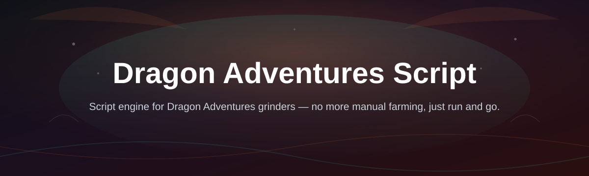
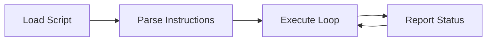

# dragon-adventures-script-engine

*A lightweight companion for players who want more control over their Dragon Adventures sessions.*

> **TL;DR**
> - This is a standalone engine built around **Dragon Adventures Script**, made for players who want repeatable in-game actions without touching a browser console.
> - It runs on **Windows 10/11**, needs no install toolchain, and updates ship from a single landing page.
> - Grab it, run it, load a script — no accounts, no clone commands, no guesswork.

## What this is

**dragon-adventures-script-engine** is a desktop tool built specifically around **Dragon Adventures Script**, the scripting layer players use to automate repetitive actions inside Dragon Adventures — things like resource loops, pathing, or timed actions that would otherwise mean sitting and clicking for hours. Instead of pasting snippets into a browser console every session, this engine gives you a persistent window where scripts load, run, and stay organized.

It's not a game mod and it doesn't touch Roblox's client files. Think of it as a script runner: you open it, pick or write a Dragon Adventures Script, hit run, and the engine handles execution while you play. The project exists because most script-sharing happens across scattered Discord links and Pastebin dumps — this repo consolidates that into one maintained tool with a real changelog.

  

The button above opens the project's landing page, where the current build is available to download.

## Who it is for

- **Players grinding long sessions** who want reliable repeat actions instead of manual clicking.
- **Script writers** who want a stable place to test and iterate on Dragon Adventures Script without rewriting boilerplate each time.
- **Returning players** picking Dragon Adventures back up and looking for a simpler workflow than console pasting.
- **Low-spec Windows users** who need something light that doesn't demand a dev environment.
- **Server communities** that share scripts and want a common runner everyone can use the same way.

## What you can do

- **Run Dragon Adventures Script files directly** from a saved folder instead of pasting text each time.
- **Save and organize multiple scripts** for different farming routes, events, or dragon types.
- **Toggle scripts on and off mid-session** without restarting the engine.
- **Adjust basic run settings** like loop delay and repeat count per script.
- **Keep a local script history** so you can revert to an earlier version you liked better.
- **Import scripts from text files** without editing engine code.
- **See a simple status readout** while a script is active, so you know it's actually running.
- **Update the engine independently** of the game — new builds don't require reinstalling anything else.

## Getting started

1. **Open the landing page** using the download button above.
2. **Download the latest build** listed there — it's a single Windows executable.
3. **Run the file** and let the window load; no setup wizard, no admin prompts required.
4. **Load a Dragon Adventures Script** from the file picker or paste one into the editor pane.
5. **Press run** and switch back to the game — the engine keeps working in the background.

## Requirements

- **Windows 10 or 11**, 64-bit.
- **No development toolchain** — the engine is a standalone executable, nothing to compile.
- **No account or sign-in** — everything runs locally on your machine.
- A working install of the game itself, obviously; the engine talks to nothing else.

## How it works

The engine sits between you and the game as a small local runner. It reads a script, prepares it, executes the instructions in sequence, and reports status back to its own window — it never modifies game files on disk.

1. **Load** — you pick or paste a Dragon Adventures Script.
2. **Parse** — the engine checks the script structure before running anything.
3. **Execute** — instructions run in a loop based on your settings.
4. **Report** — the status pane shows whether the script is active, paused, or errored.
5. **Repeat or stop** — you control when a loop ends, per script.

## FAQ

**Is Dragon Adventures Script the same as the game's built-in commands?**
No. It's a separate scripting layer players use for automation; the engine here just runs those scripts more conveniently than a browser console.

**Does this work if I've never written a script before?**
Yes — you can load pre-written scripts from the community and run them as-is. Writing your own is optional.

**Will this get me banned?**
Any automation carries some account risk in any online game. This tool doesn't hide what it does or interact with anti-cheat systems directly, but you're using it at your own discretion.

**Can I use this on Mac or Linux?**
Not currently. The build targets Windows 10/11 only.

**Why isn't this on the Microsoft Store or a package manager?**
Distribution is intentionally simple — one landing page, one build, no middleman store review cycle to wait on.

## Troubleshooting

**The engine window opens but nothing happens when I press run.**
Check that a script is actually loaded in the editor pane — an empty script will just sit idle.

**Windows flags the download as unrecognized.**
This is common for small independent tools without a paid code-signing certificate. Verify you downloaded from the landing page linked in this repo before proceeding.

**A script runs once and then stops.**
Check the loop or repeat setting for that script — some scripts are written to run a fixed number of times by design.

**The window feels unresponsive during long loops.**
Long-running scripts with tight delays can make the status pane lag slightly; this is cosmetic and doesn't affect execution.

## License

Released under the [MIT License](LICENSE). Use it, modify it, share it — no warranty is provided, and you're responsible for how you use it within the game's terms of service.

  

